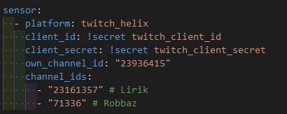
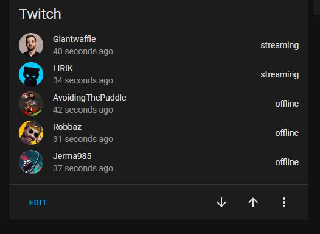
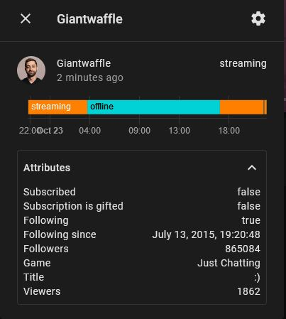

# ha_twitch_helix

## Intro

Custom Component to integrate with Twitch helix api

It looks like the original Twitch sensor integration uses the Twitch V5 API which is deprecated.
New Twitch apps doesn't seem to work with this deprecated API.

This component does mostly the same as the original integration found here (https://www.home-assistant.io/integrations/twitch/), but the underlying implementation is using the Twitch Helix API.

## Prerequisites

This component requires a Twitch developer app which can be setup here: https://dev.twitch.tv/console/apps

## Installation

### Using HACS

You can install this custom component using the Home Assistant Community Store (HACS). Search for "Twitch Helix".
If you don't have HACS installed and want to know more you can read about it at <https://hacs.xyz/>

### Installing manually

Download the latest release files and copy the "twitch_helix" folder into your "config/custom_components" folder.

### Configuration

This component requires setup in the configuration.yaml file.

Configuration requires channel ids.
Channel ids can be found by visiting this website and enter the display name of the Twitch channel: https://www.streamweasels.com/support/convert-twitch-username-to-user-id/

example of setup in configurations.yaml

`client_id`: client id acquired in Twitch developer app  
`client_secret`: client secret acquired in Twitch developer app  
`own_channel_id`: channel id of your twitch channel. Used to check if channels are followed and subscribed to.  
`channel_ids`: list of channel ids to create entities for

Channel ids can be resolved here by Twitch username: https://www.streamweasels.com/support/convert-twitch-username-to-user-id/

## Examples

