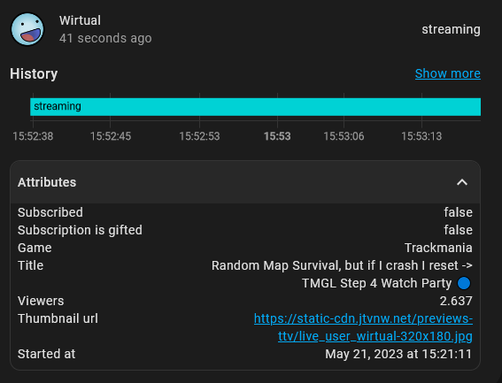

# ha_twitch_helix

[](https://github.com/hacs/integration)
[](https://opensource.org/licenses/MIT)

## Intro

Custom Component to integrate with Twitch helix api

It looks like the original Twitch sensor integration uses the Twitch V5 API which is deprecated.
New Twitch apps doesn't seem to work with this deprecated API.

This component does mostly the same as the original integration found here (https://www.home-assistant.io/integrations/twitch/), but with some extra features and the underlying implementation is using the Twitch Helix API.

## Prerequisites

This component requires a Twitch developer app which can be setup here: https://dev.twitch.tv/console/apps

## Installation

### Using HACS

You can install this custom component using the Home Assistant Community Store (HACS). Click the top right corner in HACS and add this repository to the "Custom repositories" - https://github.com/Radioh/ha_twitch_helix/. After adding the repository you You should be able to search for "Twitch Helix" and install it.
If you don't have HACS installed and want to know more you can read about it at <https://hacs.xyz/>

### Installing manually

Download the latest release files and copy the "twitch_helix" folder into your "config/custom_components" folder.

### Configuration

This component requires setup in the configuration.yaml file.

example of setup in configurations.yaml

```
sensor:
  - platform: twitch_helix
    client_id: !secret twitch_client_id
    client_secret: !secret twitch_client_secret
    own_channel: "my_channel"
    thumbnail_dimensions: 320x180
    channels:
      - "LIRIK"
      - "Robbaz"
      - "Giantwaffle"
      - "AvoidingThePuddle"
    api_opt_outs:
      # - subscription_user
      # - follow_user
      # - follow_total
      # - stream
```

`client_id`: client id acquired in Twitch developer app.\
`client_secret`: client secret acquired in Twitch developer app.\
`own_channel`: channel username of your twitch channel. Used to check if channels are followed and subscribed to.\
`thumbnail_dimensions`: optional parameter. Format is {width}x{height} for thumbnail_url dimensions. Default value is "{width}x{height}" where you need to replace values yourself in the url.\
`channels`: list of channel usernames to create entities for.\
`api_opt_outs`: optional parameter. List of apis calls, which can be opted out of. Consider using this if you have a lot of streamers and is hitting the Twitch API rate limit.\

## Examples



